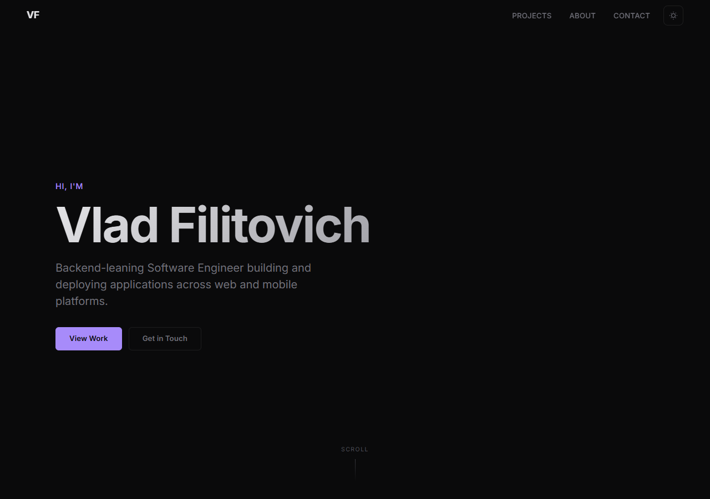

# Vlad Filitovich — Portfolio

Personal portfolio site showcasing software engineering projects across web, mobile, data visualization, and cloud infrastructure.



## Features

- Dark / light theme toggle with localStorage persistence
- Scroll-triggered reveal animations
- Project detail modals with extended descriptions, links, and image galleries
- Responsive design with mobile hamburger menu
- Zero dependencies — pure HTML, CSS, and vanilla JavaScript

## Projects

| Project | Stack | Year |
|---------|-------|------|
| **SporeScope** | React, TypeScript, Firebase, Recharts | 2025 |
| **Hot Springs Finder** | Leaflet.js, JavaScript, GitHub Pages | 2025 |
| **Bio Chart** | React, TypeScript, Firebase, Python, AWS EC2 | 2023 |
| **Covid Dashboard** | D3.js, Mapbox, Webpack, MVC | 2021 |
| **BH Healthcare** | React, Bootstrap, Formik, Fuse.js | 2020 |
| **Language for Kids** | JavaScript, Figma, Firebase | 2022 |
| **MedArt Endodontics** | HTML/CSS, JavaScript | 2021 |
| **Memoji** | HTML5, CSS3, ES6+ | 2020 |
| + more | Node.js, Flask, FastAPI, React Native | Various |

## Run Locally

No build step required. Just open `index.html` in a browser:

```bash
git clone https://github.com/llama-with-thumbs/portfolio.git
cd portfolio
open index.html   # or double-click the file
```

## Structure

```
index.html       — Single-page site
styles.css       — Dark/light theme, responsive layout, modal styles
script.js        — Theme toggle, scroll reveal, modal logic, project data
assets/          — Project screenshots and thumbnails
```

## License

MIT
